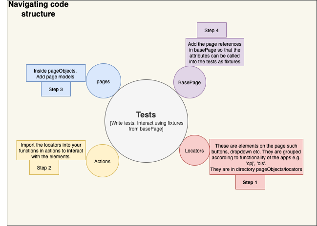

# Playwright Typescript Test Automation Suite

This project is a test automation suite built with Playwright and Typescript. It's designed to automate end-to-end tests for a web applications in Workcover, specifically focusing on the key business functionality & workflow of the applications.
## Getting Started

To get started with the test suite:
Project repository:
https://gitlab.wcq.services/stg/qe/com.workcoverqld.playright.git

1. Clone the project repository to your local machine.
2. Navigate to the project directory in your terminal.
3. Install the project dependencies by running `npm install`.
4. Create a `.env` file at the root of the project directory, and add any mandatory environment variables. See [ENVIRONMENT VARIABLES](#environment-variables--env) for more info.
5. Run the tests by executing the command `npm test` OR `npm run test` OR `npx playwright test` to run all tests. 
## Contributing

Contributions to the test suite are welcome. To contribute:

1. Fork the repository to your GitHub account.
2. Clone the forked repository to your local machine.
3. Create a new branch for your feature.
4. Make your changes and commit them with a descriptive commit message.
5. Push your changes to your forked repository.
6. Create a Merge Request targeting the main branch of the original repository.
If you are cloning directly, follow steps 2-6.

## Project Structure

The project structure revolves around the Page Object Model (POM) design pattern with basePage and fixtures concept, where each web page is modelled as a JavaScript class.

The primary files in the project are (Example):
- **fixtures**: Fixture directory contains custom functions and basePage that we can re-use across our test suite.
- **pageObjects**: Each page is represented by a TypeScript class. Within the directory are sub directories to model the pages based on the web app functions. 
  - ***Actions***: Actions represent operations that a user can perform on a page. Within this directory are subdirectories based off web app functionality e.g. ***cpj***,***ols*** etc. Within these directories are classes with various functions to perform the actions related to the specific page. For example within ***ols*** `ClaimsLodgementActions.actions.ts` in this file is a class and within which are the action functions related to Claims Lodgement from Online Services (ols).
  - ***Locators***: The locators for identifying elements on the webpage are organized and stored in the subdirectories mimicking the web app functionality e.g. inside subdirectory ***ols*** are files containing element locators such as `locators.business.ts` which contains all the locators for creation of new business types in online services.
  - ***pages***: This contains the page models based on web application functionality. An example of such model is `claimsLodgement.page.ts` which is a model of claims lodgement page object.
- **Tests**: These are the actual test cases that are executed. The tests are structured based off on web application functionality. There are subdirectories such as ***ols***, ***cpj*** etc that contain the test files. An example of a test in subdirectory ***ols*** being the `claimsLodgement.spec.ts` test spec.


## ENVIRONMENT VARIABLES  .env
Environment variables are used to set secure information such as credentials and URLS. 
_(When running in a pipeline these variables are set or fetched by that tool.)_   

When running locally we create a `.env` file at the root folder of the project (e.g. `com.workcoverqld.playright`).

### Local .env file contents
This file must contain the environment variables that will be used during the creation of test cases.
The recommended format to declare env variable is `NAME_OF_THE_VARIABLE = '<value here>`
An example of the .env file for running an OLS basic test case e.g. [panelOne](./tests/ols/panelOne.spec.ts) could be:

```dotenv
OLS_URL='https://<rest of url here>'
PANEL_ONE_USERNAME='testuser'
PASSWORD='<the password>'
```

### Checking we have the required environment variables
The [env.validations](./fixtures/env.validations.ts) fixture provides some utilities to check we have valid URLs from the environment. An example of this being used is:

1. The test or page model calls the `getAndCheckUri` utility before attempting `goto`
   ```typescript
    const olsBaseUrl = await getAndCheckUri(urls.ols.baseURL);
    await this.page.goto(olsBaseUrl);
   ```
2. The name of the environment variable is passed - in this example
    `urls.ols.baseURL` refers to `OLS_URL` from the [locators list](environmentSettings/ols.environmentSettings.ts)
3. The `getAndCheckUri` utility returns the url as a string if a valid one is found, or throws appropriate errors if a valid format string is not found.

**Note:** 
This approach could be used for other environment variables, and is recommended when they are mandatory (ie a test run would fail without them)

|**DON'T ADD .env TO A GIT REPO.**|
|--------------------------------------| 
|*Make sure that .gitignore contains an entry for .env before creating the file*|


## Sample code Example
In this code example, we shall follow through a simple test that highlights how the flow between different components work:
The example we shall use is ***Claims lodgement*** from online services (ols).
1. **Locators** for claims lodgement are found in `pageObjects/locators/ols/locators.claims.ts`
```typescript
/*This file contains locators for claims lodgement*/
export const claimsLocators = {
  lodgement: {
      //Claims lodgement
      claimLinkByText: ".sectionBody ul li a >> text='Claim lodgement'",
      claimsHeaderLabelText: "#formHeader >> text='Make a claim'",
      reportAnInjuryHeaderLabelText: "#formHeader >> text='Report an injury'",
      claimInitiatorCodeDropdown:'[id^="injuredPersons"][id$=".initiatorCode"]',
      //The rest of the locators go here
  }     
}
```
2. **Actions** class related to claims lodgement are located in `pageObjects/actions/ols/claimslodgement.action.ts`. The locators are imported into this file and functions that interact with the page model related to functionality claims lodgement online are captured as follows:

```typescript

import { expect,Page } from "@playwright/test";
import { claimsLocators } from "../../locators/ols/locators.claims";
//Other imports as used in the actual code go here

const personalData = generatePersonalData();
let doB = personalData.dateOfBirth;
const address = generateAddress();
const completeAddress = address.streetNo + ' ' + address.street + ' ' +
    address.suburb + ' ' + address.state + ' ' + address.postCode;
let email = personalData.firstName + '@mailinator.com'
export default class ClaimsLodgementActions {
    page: Page;

    constructor(page: Page) {
        this.page = page;
    }
    /*This function handles interactions on first two tabs of claims lodgement page.*/
    public async enterWorkersDetails() {
        //verify the texts exist on the page
        const textArray = [pageTexts.olsHomePage.contactUs, pageTexts.olsHomePage.mainTitle];
        checkAllTextsExistOnPage(this.page, textArray);
        await this.page.click(claimsLocators.lodgement.claimLinkByText);
        expect(await this.page.isVisible(claimsLocators.lodgement.claimsHeaderLabelText)).toBe(true);
        await assertAndLogTab(this.page, '.wizard', 'Worker', 'Tell us who you are');
        await this.page.locator(claimsLocators.lodgement.claimInitiatorCodeDropdown).selectOption({ value: 'E' });
        //Other interactions go here
        await clickOnRecaptchaCheckbox(this.page, claimsLocators.lodgement.recaptchaCheckIfame, claimsLocators.lodgement.recaptchaCheckbox);
        await this.page.waitForTimeout(2000);
        await this.page.click(claimsLocators.lodgement.submitButton);
        //Check the error message is not displayed
          errorMessageDisplays(this.page, errorMessages.olsCliams);
    }
    //The rest of the functions go here:
}
```
3. ***Page model*** - the page model is handled in `pageObjects/pages/ols/claimsLodgement.page.ts`
We reference the actions / interactions by calling the functions as follows
```typescript
import { Page } from "@playwright/test";
import ClaimsLodgementActions from "../../actions/ols/claimsLodgement.actions";
import AdditionalReportableInjuriesPaymentsActions from "../../actions/ols/additionalReportableInjuriesPayments.actions";
import IncidentNotificationsActions from "../../actions/ols/incidentNotification.actions";
import { urls } from "../../locators/ols/locators.URLS";

export default class ClaimsLodgementOnline {
    page: Page;
    claimsLodgementActions: ClaimsLodgementActions;
    additionalReportableInjuryPaymentsActions:AdditionalReportableInjuriesPaymentsActions;
    incidentNotificationsActions: IncidentNotificationsActions;

    constructor(page: Page) {
        this.page = page;
        this.claimsLodgementActions = new ClaimsLodgementActions(this.page);
        this.additionalReportableInjuryPaymentsActions = new AdditionalReportableInjuriesPaymentsActions(this.page);
        this.incidentNotificationsActions= new IncidentNotificationsActions(this.page);

    }

    public async goto() {
        await this.page.goto(urls.ols.baseURL);
    }

    public async lodgeNewClaims() {
       await this.claimsLodgementActions.enterWorkersDetails();
       await this.claimsLodgementActions.enterInjuryDetails();
       await this.claimsLodgementActions.enterEmploymentDetails();
       await this.claimsLodgementActions.validateSummary();
    }
    //Other functions go here

}
```
4. ***basePage.ts** is defined part of `fixture\basePage.ts`. It's where we link all the page models to be accessible as fixtures in our tests.
```typescript
import { test as base } from '@playwright/test';
import Tools from '../pageObjects/pages/cpj/tools.page';
import ClaimCorrespondence from '../pageObjects/pages/cpj/claimCorrespondence.page';
//More imports go here

export const test = base.extend<{
    claimsLodgementPage: ClaimsLodgementOnline;
    newBusinessPage: NewBusinessRegistrationOnlinePage;
    //More code goes here
}>({

    onlineServicesPublicIndexPage: async ({ page }, use) => {
        await use(new OnlineServicesPublicIndexLinksPage(page));
    },
    claimsLodgementPage: async ({ page }, use) => {
        await use(new ClaimsLodgementOnline(page));
    }
    //The rest of the code goes here
})
```
5. The ***tests*** are stored under `tests/ols/claimsLodgement.spec.ts`
```typescript
// This will handle the claim lodgement from external pages such as OLS claim lodgement 
import { test } from "../../fixtures/basePage";

test.describe('Lodge and register a claim - @olsClaims', () => {
    test.beforeEach(async({claimsLodgementPage}) =>{
        await claimsLodgementPage.goto();
    });
    test.afterEach(async({claimsLodgementPage}) =>{
        await claimsLodgementPage.page.close();

    })
    /*This is the claim lodgement form in OLS claim lodgement*/
    test('Lodge claim in Public Page Claim Lodgement', async ({ claimsLodgementPage }) => {
        
        await claimsLodgementPage.lodgeNewClaims();
    });

    //More tests related to Claims lodgement go here
});
```
## License
This project is licensed under the terms of the Workcover QLD license..